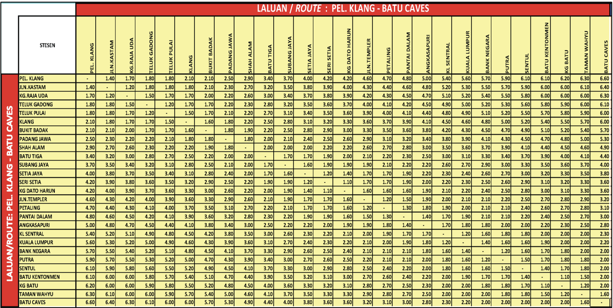

# KTM Komuter Online Ticketing System

## Introduction
This project is an online ticketing system for KTM Komuter developed using ASP.NET MVC with C#. It allows passengers to purchase tickets from any selected station to another, covering all routes provided in the fare table. The system offers one-way or return tickets and provides discounts for senior citizens (30%), disabled (35%), and students (25%).

## Features
- **Purchasing Tickets**: Passengers can purchase tickets by providing purchaser information such as name, identity card/passport number, and email address.
- **Discounts**: Senior citizens, disabled individuals, and students are offered discounts on ticket prices.
- **Input Validation**: The system includes input validation to ensure accurate data entry.
- **Email Notifications**: After purchase, purchasers receive email notifications containing transaction details.
- **Database Storage**: All transaction details are stored in the database.
- **Management Reports**: Management can produce reports on travel and transaction information using LINQ for filtering and sorting.
- **User Interface**: The user interface incorporates Bootstrap for styling and ASP.NET MVC layout for navigation differentiation.
- **Additional Features**: The system includes other beneficial features for customers and management.

## Project Guidelines
- **Group Project**: Developed in a group of 3 to 4 students.
- **Functionality Marks**:
  - Purchasing of tickets and correct calculations for all routes: 25
  - Input validation: 10
  - Ticket, info, layout, formatting & email notification: 15
  - All detail transactions must be stored in the database: 15
  - Management can produce reports on various travel and transaction information: 10
  - Good navigation structure and design of the user interface: 15
  - Other features that may be beneficial to customers or management: 10
- **Demo and Submission**: Demonstration scheduled on 17 June 2024. Complete project folder upload and report submission required.

## Ktm Fare route 

  
## Project Contributors
- Afeef
- Azam
- Ammar
- Naqie

## License
This project is licensed under the [MIIT License](LICENSE).
